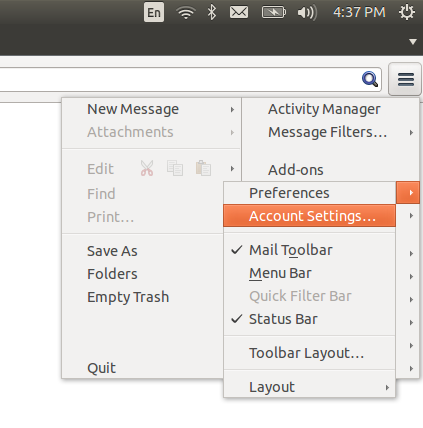
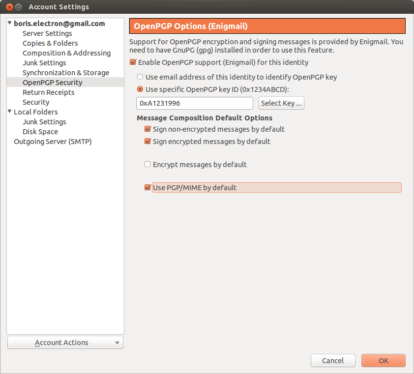

# How to Sign an Email in Linux

If you followed the [Getting Started](/getting_started/) guide, you should be using Thunderbird and Enigmail for your email, and all of your emails should get signed by default. Let's check some settings to make sure Thunderbird is configured correctly for this.

Click the menu button, hover over Preferences, and choose Account Settings.

Go to the OpenPGP Security tab. Make sure "Enable OpenPGP support (Enigmail) for this identity" is checked. "Use specific OpenPGP key ID" should be selected, and if your key isn't already selected you can click Select Key to select it.

You should also check "Sign non-encrypted message by default", "Sign encrypted messages by default", and "Use PGP/MIME by default", but not "Encrypt messages by default".

Now when you start writing an email, the pen icon in the bottom right should be gold:

You can always click that icon to turn signing on or off.

When you sign an email, you use your PGP secret key, so you will be prompted for your passphrase if Enigmail doesn't already have it in memory.

